# Academic Credit Authenticity Tester (🐈 ACAT )

# 

### 1. Features/Operation 

1. **Allow uploading document/s by Educational Institute**

   1. Educational Institute can upload new or old issued Academic Credits separately or in Bulk.

   2. Extract **Graphical Information** such as Signature, Photos, Logo, Stamp etc from uploaded document.

   3. Extract all readable text using sophisticated **OCR** system and parse it into computer readable format.

   4. Generate Unique Identification Key **UIK** and generate a Scanable and Printable image which can be printed or sticked on the original valid document.

   5. Store extracted graphical informations securely, safely and in immutable way.

   6. Store extracted text information and generated identification key into hybrid bloc-chain based database. 

      

2. **Allow Employers/Institutes/Individuals to verify authenticity of an Academic Certificate **

   1. User can Upload the document through the **website portal** or Scan through **Mobile App** for verification of the Document

   2. Extract Graphical Information such as signature, face, logo, stamp etc from the test documents and verify if similar graphical entry exists in the database and Issue Alert if document is tampered eg check if face/signature/stamp/logo is changed.

   3. Issue Alert highlighting the tampered part or region.

   4. Scan readable text from the document and parse it into computer readable form using **AI Model** the readable text and generate it's **UIK** and cross verify with changed entries such as increased marks from the one already in database.

   5. Issue Alert Highlighting the tampered entries in the document

      

3. **Allow Admin to Access Detailed and Statical information of Usage and Caught Fraudulent Documents  **

   

### 2. Effectiveness In Solving the Problem

1. Automatic Digitalization of old documents and store in immutable fashion.
2. Can detect fake signature, face, stamp, logo etc
3. Can detect fake entries such as increased marks
4. Fast verification Process
5. Easy to use design save cost of training staff and make adoption easy
6. Keeps track of Fraudulent Documents

### 2.  Software Components and Structural Diagram

1. **Web API: for Easily, Securely, Platform-Independent Access aka web portal**

2. **Image Processing System: For extraction, storage and verification of graphical information**

3. **Sophisticated Image OCR Engine with integrated Image Processing System: for Extraction of text data/entries automatically** 

4. **AI model: for automated parsing of human readable text into Computer Readable format without manual labor**

5. **Unique Identity Key Generator: for generating unique key based on all information of the entries in the document**

6. **Hybrid Block-chain based Database Management System: for storing data in immutable manner**

7. **QR encode/decode System: for generating and reading printable UIK for quick verification**

   # Proposed Architectural Diagram

```mermaid
flowchart TD
    %% Main Server/s Which is/are responsible where all the
    %% operations are performed securely.
    subgraph PORTAL["🛠️ Server Components and Configuraion"]
    	RIJWAN("->By Rijwan on 29th September, 2025")
        API["🔗 Portal Access APIs"]
        HASH["Hash-Key Generator 🔐"]
        QR["QR En/De-code 🬳🬤"]
        AI["AI Model 🤖"]

        %% Main App that handle all the logic
        subgraph APP["Main Application⚙️"]
            DOCUPLOAD{"Upload Document"}
            STOREIMG["Store Image"]
            EXTXT["Extract Text"]
            PARSTXT["Extract Text Into Json"]
            GENUID["Generate UID-key"]
            GENQR["Generate QR"]
            SAVEBLOCK["Add new block Entry"]
            VERF["Verify"]

            %% Logic For New Registry
            DOCUPLOAD -->|"For new Registry"| STOREIMG
            STOREIMG -->|"image"| EXTXT
            EXTXT -->|"text"| PARSTXT
            PARSTXT -->|"Standardized-json"| GENUID
            GENUID -->|"uid-key"| GENQR
            PARSTXT -->|"Standardized-json"| SAVEBLOCK
            GENQR -->|"QR-img-base64"| SAVEBLOCK
            GENUID -->|"uid-key"| SAVEBLOCK

            %% For Verification of Registry
            DOCUPLOAD -->|"For Verification"| EXTXT
            PARSTXT -->|"Standardized-json"| VERF
            GENUID -->|"uid-key"| VERF



        end


        %% OCR System
        subgraph OCRS["🏼Sophisticated OCR Engine"]
            IMGIN["Input image/pdf/graphic🖼"] ==>
            IMGPROC["Image Processing Unit🖻"] ==>
            OCR["ML based OCR"] ==>
            TXTOUT["Plain Text Output📃"]
        end

        %% A Hybrid Database Management System to prevent 
        %% tampering with the stored Data
        subgraph DBMS["⛓️Hybrid Block Chain Based DBMS"]
            DATA[("Block Database📦")] <==>
            MANAGER["Hybrid DBMS🗳"]
        end

        %% An Image database for Verifying Tampered seal signature and face
        subgraph IMGDBS["🗳️ Image Recognition Engine"]
            UPLOAD(("upload()"))
            VRIFY(("verify()"))
            IMGSLI("Image Data Extracti")
            STORE[("Image Database")]

            UPLOAD -->|"image"| IMGSLI
            IMGSLI -->|"face+seal+signature+body"| STORE
            STORE -->|"face+seal+signature+body"| VRIFY
            VRIFY -->|"image"| IMGSLI
            IMGSLI -->|"face+seal+signature+body"| VRIFY

        end

    end

    %% Goverment Approved Institution Who can Issue Academic Credits
    subgraph INST["🏛️ Institutions"]
        INST1["Institute 1"]
        INST2["Institute 2"]
        INST3["Institute 3"]
        INST_["..."]
        INSTN["Institute N"]
    end

    %% End Users Domain ie Employer, Institute, Indivisual etc,
    %% who want to verify authunticity of the documents.
    subgraph USERS["👨🏼‍💼End Users"]
        USER1["Employer"]
        USER2["Institutes"]
        USER3["Indivisual User"]
        USER_["..."]
    end
    %% Admin Board Which can fetch detail report of the portal Usage
    ADMIN["Admins"]

INST ==>|"Request/Document/s📄"| API
API ==>|"Report-data.json/QR-img"| INST

ADMIN ==>|"Usage Report Request"| API
API ==>|"Usage-Report.json"| ADMIN

USERS ==>|"Document📃"| API
API ==>|"Detailed_Report.json\n🗞️"| USERS

API -->|"Request + Data"| APP
APP -->|"Response + Data"| API

EXTXT -->|"Image 🖼"| OCRS
OCRS -->|"Plain-Text 🗎"| EXTXT

PARSTXT -->|"Plain-Text 🗎"| AI
AI -->|"Standardized-Json 📑"| PARSTXT

GENUID -->|"Standardized-Json 📑"| HASH
HASH -->|"UID-key-txt 🔑"| GENUID

GENQR -->|"UID-key-txt 🔑"| QR
QR -->|"QR-img-base64"| GENQR

SAVEBLOCK -->|"Standardized-Json UID-key-txt QR-img-base64/Rquest"| DBMS
DBMS -->|"Stadardized-Json + UID-key"| VERF

STOREIMG -->|"image-document 📄"| UPLOAD
VERF -->|"image-document 📄"| VRIFY
VRIFY -->|"Report"| VERF



    linkStyle 0 stroke:red,stroke-width:3px
    linkStyle 1 stroke:blue,stroke-width:3px
    linkStyle 2 stroke:green,stroke-width:3px
    linkStyle 4 stroke:yellow,stroke-width:3px
    linkStyle 5 stroke:pink,stroke-width:3px
    linkStyle 7 stroke:brown,stroke-width:3px
    linkStyle 8 stroke:magenta,stroke-width:3px
    linkStyle 9 stroke:black,stroke-width:3px
    linkStyle 10 stroke:red,stroke-width:3px
    linkStyle 11 stroke:blue,stroke-width:3px
    linkStyle 12 stroke:green,stroke-width:3px
    linkStyle 13 stroke:orange,stroke-width:3px
    linkStyle 14 stroke:yellow,stroke-width:3px
    linkStyle 15 stroke:black,stroke-width:3px
    linkStyle 16 stroke:red,stroke-width:3px
    linkStyle 17 stroke:blue,stroke-width:3px
    linkStyle 18 stroke:green,stroke-width:3px
    linkStyle 19 stroke:orange,stroke-width:3px
    linkStyle 20 stroke:red,stroke-width:3px
    linkStyle 21 stroke:yellow,stroke-width:3px
    
    %% Change colors of specific nodes
    style INST fill:blue,stroke:#0288d1,stroke-width:2px,color:#01579b
    style APP fill:,stroke:#2e7d32,stroke-width:2px,color:#1b5e20
    style OCRS fill:pink,stroke:#c62828,stroke-width:2px,color:#b71c1c
	style USERS fill:yellow,stroke:#0288d1,stroke-width:2px,color:#01579b
    style DBMS fill:green,stroke:#2e7d32,stroke-width:2px,color:#1b5e20
    style ADMIN fill:red,stroke:#c62828,stroke-width:2px,color:#b71c1c
    style IMGDBS fill:lightblue,stroke:#0288d1,stroke-width:2px,color:#01579b
    style APP fill:lightyellow,stroke:#2e7d32,stroke-width:2px,color:#1b5e20
    style PORTAL fill:hotpink,stroke:#c62828,stroke-width:2px,color:#b71c1c
    style RIJWAN fill:none,stroke:none,color:yellow

	
```

